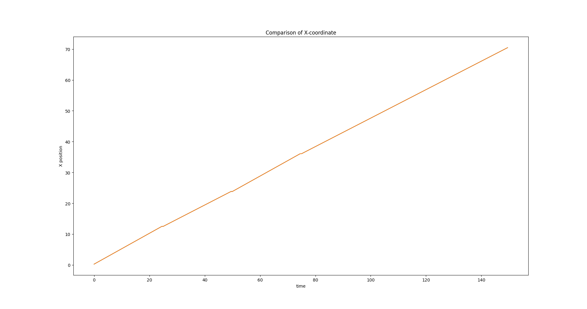
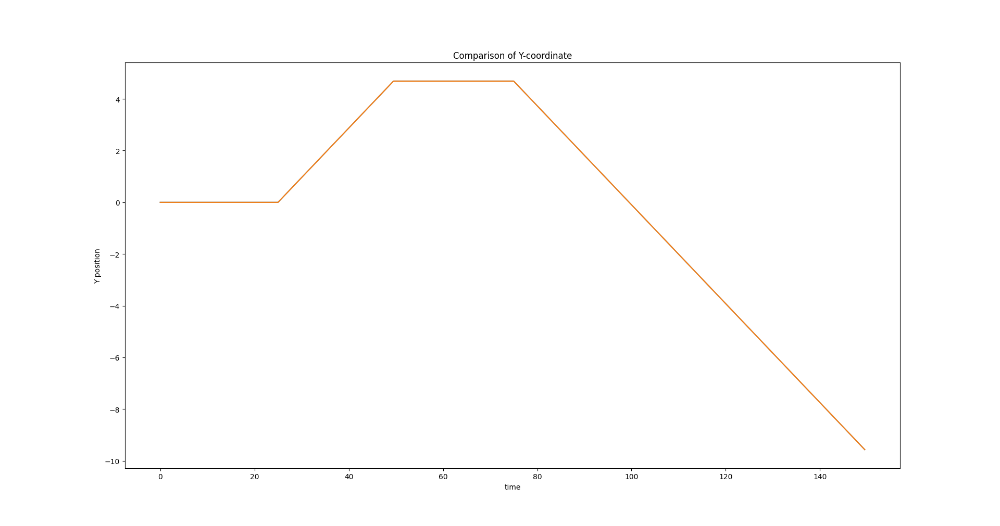
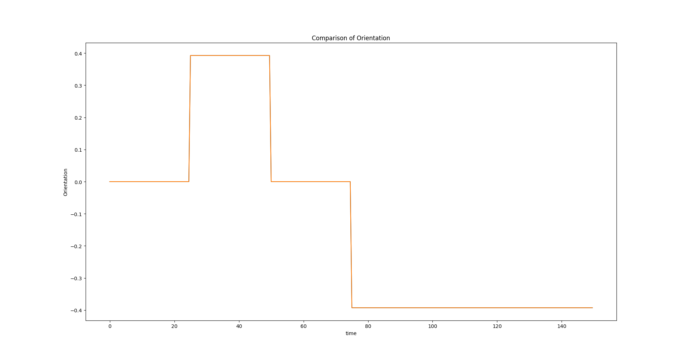

# EXample 2: Extented Kalman filtering

In this example we will develop an Extended Kalaman Filter or EKF for short. In you do not know what an EKF is or how it works have a look at here: 
https://en.wikipedia.org/wiki/Extended_Kalman_filter. 

Briefly, the EKF is an improvement over the classic Kalman Filter that can be applied to non-linear systems. The crux of the algorithm 
remains the predictor-corrector steps as in the Kalman Filter. 

In this example we will use the ```ExtendedKalmaFilter``` class in order to estimate 
the state of a differential drive system. 

## The driver code

```
#include "cubeai/base/cubeai_types.h"
#include "cubeai/estimation/extended_kalman_filter.h"
#include "cubeai/utils/iteration_counter.h"
#include "cubeai/io/csv_file_writer.h"
#include "rlenvs/dynamics/diff_drive_dynamics.h"
#include "rlenvs/dynamics/system_state.h"
#include "rlenvs/utils/unit_converter.h"

#include <boost/log/trivial.hpp>
#include <iostream>
#include <unordered_map>
#include <any>
#include <vector>
#include <random>

namespace example_2
{

using cubeai::real_t;
using cubeai::uint_t;
using cubeai::DynMat;
using cubeai::DynVec;
using cubeai::estimation::ExtendedKalmanFilter;
using cubeai::utils::IterationCounter;
using cubeai::io::CSVWriter;
using rlenvscpp::dynamics::DiffDriveDynamics;
using rlenvscpp::dynamics::SysState;


class ObservationModel
{

public:

	// the ExtendedKalmanFilter expects an exposed
	// input_type
    typedef  DynVec<real_t> input_type;

    ObservationModel();

    // simply return the state
    const DynVec<real_t> evaluate(const DynVec<real_t>& input)const;

    // get the H or M matrix
    const DynMat<real_t>& get_matrix(const std::string& name)const;

private:

    DynMat<real_t> H;
    DynMat<real_t> M;
};

ObservationModel::ObservationModel()
    :
      H(2, 3),
      M(2, 2)
{
	H = DynMat<real_t>::Zero(2,3);
	M = DynMat<real_t>::Zero(2,2);
    H(0, 0) = 1.0;
    H(1,1) = 1.0;
    M(0,0) = 1.0;
    M(1, 1) = 1.0;

}

const DynVec<real_t>
ObservationModel::evaluate(const DynVec<real_t>& input)const{
    return input;
}

const DynMat<real_t>&
ObservationModel::get_matrix(const std::string& name)const{
    if(name == "H"){
        return H;
    }
    else if(name == "M"){
        return M;
    }

    throw std::logic_error("Invalid matrix name. Name "+name+ " not found");
}

const DynVec<real_t> get_measurement(const SysState<3>& state){
	
   DynVec<real_t> result(2);
   result[0] = state.get("X");
   result[1] = state.get("Y");
   return result;
}


}

int main() {

    using namespace example_2;
	
	BOOST_LOG_TRIVIAL(info)<<"Starting example...";

	uint_t n_steps = 300;
	auto time = 0.0;
	auto dt = 0.5;
	
	/// angular velocity
	auto w = 0.0;
	
	/// linear velocity
	auto vt = 1.0;
	
	std::array<real_t, 2> motion_control_error;
	motion_control_error[0] = 0.0;
	motion_control_error[1] = 0.0;
	
	DiffDriveDynamics exact_motion_model;
	exact_motion_model.set_matrix_update_flag(false);
	exact_motion_model.set_time_step(dt);
	
	DiffDriveDynamics motion_model;
	motion_model.set_time_step(dt);
	
	std::map<std::string, std::any> input;
	input["v"] = 1.0;
	input["w"] = 0.0;
	input["errors"] = motion_control_error;
	motion_model.initialize_matrices(input);
	
	ObservationModel observation;
	
	ExtendedKalmanFilter<DiffDriveDynamics, ObservationModel> ekf(motion_model, observation);
	
	DynMat<real_t> R = DynMat<real_t>::Zero(2, 2);
	R(0,0) = 1.0;
	R(1, 1) = 1.0;
	
	DynMat<real_t> Q = DynMat<real_t>::Zero(2, 2);
	Q(0,0) = 0.001;
	Q(1, 1) = 0.001;
	
	DynMat<real_t> P = DynMat<real_t>::Zero(3, 3);
	P(0, 0) = 1.0;
	P(1, 1) = 1.0;
	P(2, 2) = 1.0;
	
	ekf.with_matrix("P", P)
	   .with_matrix("R", R)
	   .with_matrix("Q", Q);
	   
	CSVWriter writer("state");
	writer.open();
	std::vector<std::string> names{"Time", "X_true", "Y_true", "Theta_true", "X", "Y", "Theta"};
	writer.write_column_names(names);

    try{
		
		
		BOOST_LOG_TRIVIAL(info)<<"Starting simulation... "<<time;
        uint_t counter=0;

        std::map<std::string, std::any> motion_input;
        motion_input["v"] = vt; // we keep the velocity constant
        motion_input["errors"] = motion_control_error;

        for(uint_t step=0; step < n_steps; ++step){

			BOOST_LOG_TRIVIAL(info)<<"Simulation time: "<<time;
            
            if(counter == 50){
              w = rlenvscpp::utils::unit_converter::degrees_to_rad(45.0);
            }
            else if(counter == 100){
               w = rlenvscpp::utils::unit_converter::degrees_to_rad(-45.0);
            }
            else if(counter == 150){
               w = rlenvscpp::utils::unit_converter::degrees_to_rad(-45.0);
            }
            else{
                w = 0.0;
            }

            motion_input["w"] = w;
            
            auto& exact_state = exact_motion_model.evaluate(motion_input);

            ekf.predict(motion_input);

            auto& state = motion_model.get_state();
            auto z = get_measurement(state);
            ekf.update(z);

            BOOST_LOG_TRIVIAL(info)<<"Position: "<<ekf.get("X")<<", "<<ekf.get("Y");
            BOOST_LOG_TRIVIAL(info)<<"Orientation: (degrees)"<<rlenvscpp::utils::unit_converter::rad_to_degrees(ekf.get("Theta"));
            BOOST_LOG_TRIVIAL(info)<<"V: "<<vt<<", W: "<<w;

            std::vector<real_t> row(7, 0.0);
			row[0] = time;
            row[1] = exact_state.get("X");
            row[2] = exact_state.get("Y");
			row[3] = exact_state.get("Theta");
            row[4] = state.get("X");
            row[5] = state.get("Y");
			row[6] = state.get("Theta");
            writer.write_row(row);

            time += dt;
            counter++;
        }
		
		BOOST_LOG_TRIVIAL(info)<<"Finished example...";
    }
    catch(std::runtime_error& e){
        std::cerr<<e.what()<<std::endl;
    }
    catch(std::logic_error& e){
        std::cerr<<e.what()<<std::endl;
    }
    catch(...){
        std::cerr<<"Unknown exception was raised whilst running simulation."<<std::endl;
    }
   
   return 0;
}


```

Running the code above produces the following output:

```
2024-12-26 11:02:30.754717] [0x00007f186a82e000] [info]    Starting example...
[2024-12-26 11:02:30.755323] [0x00007f186a82e000] [info]    Starting simulation... 0
[2024-12-26 11:02:30.755334] [0x00007f186a82e000] [info]    Simulation time: 0
[2024-12-26 11:02:30.755458] [0x00007f186a82e000] [info]    Position: 0.25, 0
[2024-12-26 11:02:30.755463] [0x00007f186a82e000] [info]    Orientation: (degrees)0
[2024-12-26 11:02:30.755469] [0x00007f186a82e000] [info]    V: 1, W: 0
[2024-12-26 11:02:30.755481] [0x00007f186a82e000] [info]    Simulation time: 0.5
[2024-12-26 11:02:30.755549] [0x00007f186a82e000] [info]    Position: 0.5, 0
[2024-12-26 11:02:30.755555] [0x00007f186a82e000] [info]    Orientation: (degrees)0
[2024-12-26 11:02:30.755560] [0x00007f186a82e000] [info]    V: 1, W: 0
[2024-12-26 11:02:30.755571] [0x00007f186a82e000] [info]    Simulation time: 1
[2024-12-26 11:02:30.755638] [0x00007f186a82e000] [info]    Position: 0.75, 0
[2024-12-26 11:02:30.755643] [0x00007f186a82e000] [info]    Orientation: (degrees)0
[2024-12-26 11:02:30.755649] [0x00007f186a82e000] [info]    V: 1, W: 0
[2024-12-26 11:02:30.755659] [0x00007f186a82e000] [info]    Simulation time: 1.5
[2024-12-26 11:02:30.755725] [0x00007f186a82e000] [info]    Position: 1, 0
[2024-12-26 11:02:30.755730] [0x00007f186a82e000] [info]    Orientation: (degrees)0
[2024-12-26 11:02:30.755737] [0x00007f186a82e000] [info]    V: 1, W: 0
[2024-12-26 11:02:30.755747] [0x00007f186a82e000] [info]    Simulation time: 2
[2024-12-26 11:02:30.755814] [0x00007f186a82e000] [info]    Position: 1.25, 0
[2024-12-26 11:02:30.755820] [0x00007f186a82e000] [info]    Orientation: (degrees)0
[2024-12-26 11:02:30.755825] [0x00007f186a82e000] [info]    V: 1, W: 0
[2024-12-26 11:02:30.755836] [0x00007f186a82e000] [info]    Simulation time: 2.5
[2024-12-26 11:02:30.755902] [0x00007f186a82e000] [info]    Position: 1.5, 0
[2024-12-26 11:02:30.755906] [0x00007f186a82e000] [info]    Orientation: (degrees)0
[2024-12-26 11:02:30.755909] [0x00007f186a82e000] [info]    V: 1, W: 0
[2024-12-26 11:02:30.755918] [0x00007f186a82e000] [info]    Simulation time: 3
[2024-12-26 11:02:30.755983] [0x00007f186a82e000] [info]    Position: 1.75, 0
[2024-12-26 11:02:30.755987] [0x00007f186a82e000] [info]    Orientation: (degrees)0
[2024-12-26 11:02:30.755990] [0x00007f186a82e000] [info]    V: 1, W: 0
[2024-12-26 11:02:30.755999] [0x00007f186a82e000] [info]    Simulation time: 3.5
[2024-12-26 11:02:30.756064] [0x00007f186a82e000] [info]    Position: 2, 0
[2024-12-26 11:02:30.756068] [0x00007f186a82e000] [info]    Orientation: (degrees)0
[2024-12-26 11:02:30.756071] [0x00007f186a82e000] [info]    V: 1, W: 0
[2024-12-26 11:02:30.756079] [0x00007f186a82e000] [info]    Simulation time: 4
[2024-12-26 11:02:30.756144] [0x00007f186a82e000] [info]    Position: 2.25, 0
[2024-12-26 11:02:30.756148] [0x00007f186a82e000] [info]    Orientation: (degrees)0
[2024-12-26 11:02:30.756151] [0x00007f186a82e000] [info]    V: 1, W: 0
...

[2024-12-26 11:02:30.781917] [0x00007f186a82e000] [info]    V: 1, W: 0
[2024-12-26 11:02:30.781925] [0x00007f186a82e000] [info]    Simulation time: 146.5
[2024-12-26 11:02:30.781984] [0x00007f186a82e000] [info]    Position: 69.0962, -8.99306
[2024-12-26 11:02:30.781988] [0x00007f186a82e000] [info]    Orientation: (degrees)-22.5
[2024-12-26 11:02:30.781991] [0x00007f186a82e000] [info]    V: 1, W: 0
[2024-12-26 11:02:30.781999] [0x00007f186a82e000] [info]    Simulation time: 147
[2024-12-26 11:02:30.782058] [0x00007f186a82e000] [info]    Position: 69.3272, -9.08873
[2024-12-26 11:02:30.782062] [0x00007f186a82e000] [info]    Orientation: (degrees)-22.5
[2024-12-26 11:02:30.782064] [0x00007f186a82e000] [info]    V: 1, W: 0
[2024-12-26 11:02:30.782072] [0x00007f186a82e000] [info]    Simulation time: 147.5
[2024-12-26 11:02:30.782132] [0x00007f186a82e000] [info]    Position: 69.5582, -9.1844
[2024-12-26 11:02:30.782136] [0x00007f186a82e000] [info]    Orientation: (degrees)-22.5
[2024-12-26 11:02:30.782138] [0x00007f186a82e000] [info]    V: 1, W: 0
[2024-12-26 11:02:30.782147] [0x00007f186a82e000] [info]    Simulation time: 148
[2024-12-26 11:02:30.782205] [0x00007f186a82e000] [info]    Position: 69.7891, -9.28007
[2024-12-26 11:02:30.782209] [0x00007f186a82e000] [info]    Orientation: (degrees)-22.5
[2024-12-26 11:02:30.782212] [0x00007f186a82e000] [info]    V: 1, W: 0
[2024-12-26 11:02:30.782220] [0x00007f186a82e000] [info]    Simulation time: 148.5
[2024-12-26 11:02:30.782279] [0x00007f186a82e000] [info]    Position: 70.0201, -9.37574
[2024-12-26 11:02:30.782283] [0x00007f186a82e000] [info]    Orientation: (degrees)-22.5
[2024-12-26 11:02:30.782286] [0x00007f186a82e000] [info]    V: 1, W: 0
[2024-12-26 11:02:30.782294] [0x00007f186a82e000] [info]    Simulation time: 149
[2024-12-26 11:02:30.782353] [0x00007f186a82e000] [info]    Position: 70.2511, -9.47141
[2024-12-26 11:02:30.782357] [0x00007f186a82e000] [info]    Orientation: (degrees)-22.5
[2024-12-26 11:02:30.782360] [0x00007f186a82e000] [info]    V: 1, W: 0
[2024-12-26 11:02:30.782368] [0x00007f186a82e000] [info]    Simulation time: 149.5
[2024-12-26 11:02:30.782427] [0x00007f186a82e000] [info]    Position: 70.482, -9.56709
[2024-12-26 11:02:30.782431] [0x00007f186a82e000] [info]    Orientation: (degrees)-22.5
[2024-12-26 11:02:30.782434] [0x00007f186a82e000] [info]    V: 1, W: 0
[2024-12-26 11:02:30.782442] [0x00007f186a82e000] [info]    Finished example...


```

There is a ```plot.py``` utility script that you can use to visualise the coordinates
and the orientation with respect to time. This is shown in the figures below. As we don't
include any errors the solution produced by the filter is identical to the solution
produced by simply integrating the state.







