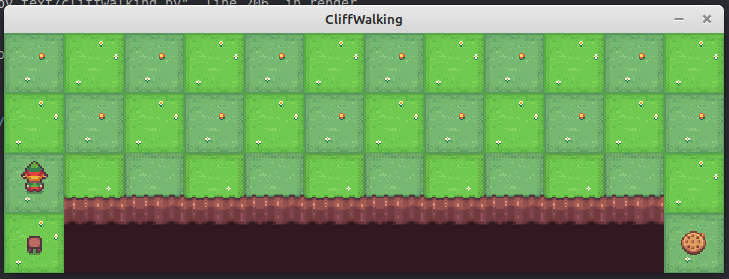
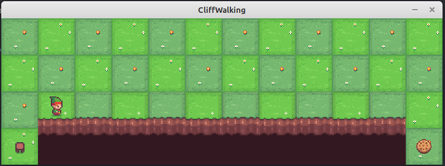
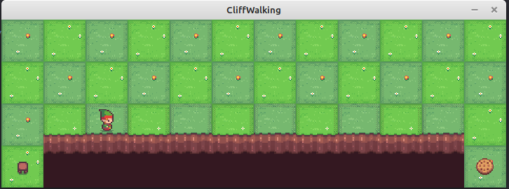
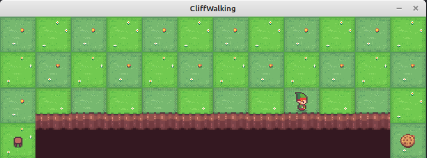
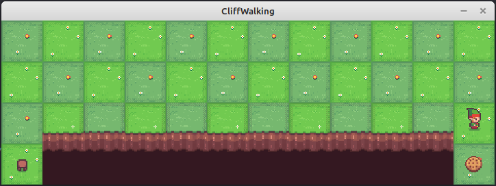
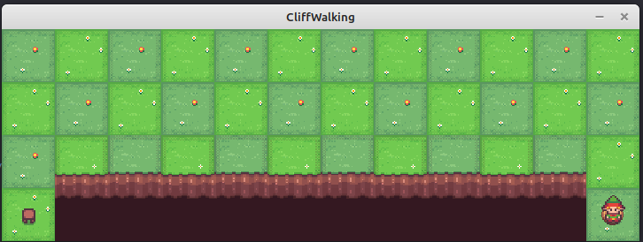

\page cuberl_example_10 CubeRL Example 10 Q-learning on `CliffWorld`

In this example, we will apply another temporal difference learning algorithm namely <a href="https://en.wikipedia.org/wiki/Q-learning">Q-learning</a>
on _CliffWorld_.  This is a Gymnasium-based environment implemented in \ref bitrl::envs::gymnasium::CliffWorld "bitrl::envs::gymnasium::CliffWorld" class.
We used this environment in example \ref cuberl_example_9 "CubeRL Example 9: SARSA on `CliffWorld`".

Q-learning, just like SARSA, is a model-free reinforcement learning algorithm that learns how good an action is in a given state, without needing a model of the environment.
As the name suggests, the algorithms learns a state-action value function $Q(s,\alpha)$.
The algorithm is very similar to SARSA. Before we show the algorithmic steps, here is the update function used in Q-learning

$$
Q(s,\alpha) = Q(s,\alpha) + \eta \big[r_t + \gamma \max_{\alpha_{t+1}} Q(s_{t+1}, \alpha_{t+1}) - Q(s,\alpha)\big]
$$

The algorithm just like SARSA looks into the future but always selects the action that provides the best $Q$. Contrast this with the update formula
for SARSA:

$$
Q(s_t, \alpha_t) = Q(s_t, \alpha_t) + \eta \left[r_{t+1} + \gamma Q(s_{t+1}, \alpha_{t+1}) - Q(s_t, \alpha_t) \right]
$$

So Q-learning instead of consulting $\pi$ about $\alpha_{t+1}$ it simply acts greedily and selects the action that provides the best state-action value function.
This is called optimistic bootstrapping; assume the best possible action will be taken next, regardless of what we'll actually do [2].
Here are the steps for Q-learning. These are very similar to SARSA:

#### Step 1

The first step is to initialize the table table that represents $Q(s,\alpha)$ to arbitrary values; often this is just zero. This however, can also
be values that encourage exploration.

#### Step 2

The algorithm begins by some be presented with a state. Q-learning needs to decide what to do whilst at this state. This is done using a policy
$\pi$ which most often will be an $\epsilon-$greedy policy.

#### Step 3

The algorithm will execute the action that was selected from step 2. The environment will respond with a reward $r_t$ and the new state $s_{t+1}$.
In order to apply the update formula we need to calculate what is the best $Q$ at $s_{t+1}$.
The update rule, see above, is using the future $maxQ(s_{t+1}, \alpha_{t+1})$ in order to update the current $Q(s_{t}, \alpha_{t})$
Compared to SARSA, in Q-learning we don't necessarily choose $\alpha_{t+1}$ when at $s_{t+1}$ but instead ask the policy to provide the action to.

#### Step 4

After updating, we move to $s_{t+1}$ and ask $\pi$ to provide us with an action and we repeat step 3.
If we've reached a terminal state (like the end of a game or a completed transaction), the episode ends and we start fresh.
The environment has to inform the agent about whether it reached the end of the game or not. So when we take an action in the environment,
we will usually receive not just a reward signal and the next state but also a flag indicating if the end of the game or simulation has been reached.

All in all, Q-learning learns the optimal policy. It is a fast and efficient algorithm that is ideal for batch learning [2].
Q-learning, compared to SARSA, is more optimistic which can be dangerous in risky domains, and it suffers from maximization bias that can overestimate action values when estimates are noisy [2].

The Q-learning algorithm is implemented in the \ref cuberl::rl::algos::td::QLearningSolver "cuberl::rl::algos::td::QLearningSolver"  class

@code{.cpp}
#include "cuberl/base/cuberl_types.h"
#include "cuberl/rl/algorithms/td/q_learning.h"
#include "cuberl/rl/policies/epsilon_greedy_policy.h"
#include "cuberl/rl/trainers/rl_serial_agent_trainer.h"

#include "bitrl/utils/io/csv_file_writer.h"
#include "bitrl/network/rest_rl_env_client.h"
#include "bitrl/envs/gymnasium/toy_text/cliff_world_env.h"

#include <iostream>
#include <iostream>
#include <unordered_map>
#include <boost/log/trivial.hpp>
@endcode

@code{.cpp}
namespace rl_example_10{

const std::string SERVER_URL = "http://0.0.0.0:8001/api";

const std::string SOLUTION_FILE = "qlearning_cliff_walking_v1.csv";
const std::string REWARD_PER_ITR = "reward_per_itr.csv";
const std::string POLICY = "policy.csv";

using cuberl::real_t;
using cuberl::uint_t;
using cuberl::rl::policies::EpsilonGreedyPolicy;
using cuberl::rl::algos::td::QLearningSolver;
using cuberl::rl::algos::td::QLearningConfig;
using cuberl::rl::policies::EpsilonDecayOption;
using cuberl::rl::RLSerialAgentTrainer;
using cuberl::rl::RLSerialTrainerConfig;
using bitrl::network::RESTRLEnvClient;
typedef  bitrl::envs::gymnasium::CliffWorld env_type;

}

int main(){

	BOOST_LOG_TRIVIAL(info)<<"Starting agent training";
    using namespace rl_example_10;

    try{
		
		RESTRLEnvClient server(SERVER_URL, true);

        // create the environment
        env_type env(server);

        BOOST_LOG_TRIVIAL(info)<<"Creating environment...";
        
		std::unordered_map<std::string, std::any> options;
    	std::unordered_map<std::string, std::any> reset_options;
        env.make("v0", options, reset_options);
        env.reset();
		
        BOOST_LOG_TRIVIAL(info)<<"Done...";
        BOOST_LOG_TRIVIAL(info)<<"Number of states="<<env.n_states();
        BOOST_LOG_TRIVIAL(info)<<"Number of actions="<<env.n_actions();

		// create an e-greedy policy. Use the number 
		// of actions as a seed. Use a constant epsilon
        EpsilonGreedyPolicy policy(0.01, env.n_actions(), 
		                           EpsilonDecayOption::NONE);

        QLearningConfig qlearn_config;
        qlearn_config.gamma = 0.9;
        qlearn_config.eta = 0.5;
        qlearn_config.tolerance = 1.0e-8;
        qlearn_config.max_num_iterations_per_episode = 1000;
        qlearn_config.path = SOLUTION_FILE;

        QLearningSolver<env_type, EpsilonGreedyPolicy> algorithm(qlearn_config, policy);

        RLSerialTrainerConfig trainer_config = {10, 1000, 1.0e-8};

        RLSerialAgentTrainer<env_type,
                QLearningSolver<env_type, EpsilonGreedyPolicy>> trainer(trainer_config, algorithm);

        auto info = trainer.train(env);
        BOOST_LOG_TRIVIAL(info)<<info;
		
		// save the reward the agent achieved per training epoch
		auto reward = trainer.episodes_total_rewards();
		auto iterations = trainer.n_itrs_per_episode();
	
		bitrl::utils::io::CSVWriter csv_writer(REWARD_PER_ITR);
		csv_writer.open();
		
		csv_writer.write_column_names({"epoch", "reward"});
		
		auto epoch = static_cast<uint_t>(0);
		for(auto val: reward){
			
			std::tuple<uint_t, real_t> row = {epoch++, val};
			csv_writer.write_row(row);
		}
		
		csv_writer.close();
		
		// build the policy
		algorithm.build_policy().save(POLICY);

    }
    catch(std::exception& e){
        std::cout<<e.what()<<std::endl;
    }
    catch(...){

        std::cout<<"Unknown exception occured"<<std::endl;
    }
    return 0;
}
@endcode

|  |
|:--:|
| **Figure 1:Playing CliffWorld step 1.**|

|  |
|:--:|
| **Figure 2:Playing CliffWorld step 2.**|

|  |
|:--:|
| **Figure 3:Playing CliffWorld step 3.**|

|  |
|:--:|
| **Figure 4:Playing CliffWorld step 9.**|

|  |
|:--:|
| **Figure 5:Playing CliffWorld step 12.**|

|  |
|:--:|
| **Figure 6:Playing CliffWorld step 13.**|

