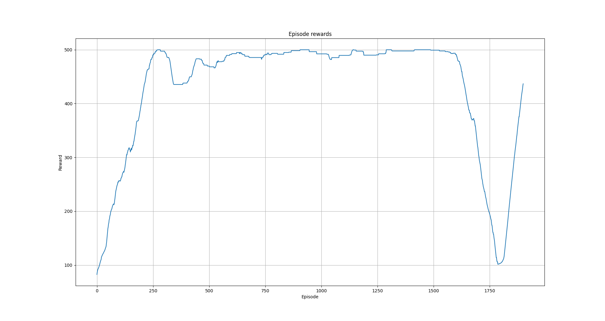

# Example 11: An A2C Solver for CartPole

Example <a href="https://github.com/pockerman/cuberl/blob/master/examples/rl/rl_example_13/rl_example_13.md">Example 13: REINFORCE algorithm on CartPole</a>
introduce the vanilla REINFORCE algorithm in order to solve the pole balancing problem. 
The REINFORCE algorithm is a simple algorithm and easy to use however it exhibits a large variance in the reward signal.

In this exampel, we will introduce <a href="https://proceedings.neurips.cc/paper_files/paper/1999/file/6449f44a102fde848669bdd9eb6b76fa-Paper.pdf">actor-critic</a> methods
and specifically the A2C algorithm.	The main objective of actor-critic methods is to further reduce the high gradient variance. 
One way towards this direction is to use the so-called reward-to-go term for a trajectory $T$. 

$$G = \sum_{k = t}^T R(s_{k}, \alpha_{k})$$

For this example to work, you will need to have both PyTorch and ```rlenvs_cpp``` enabled.


The workings of the A2C algorithm are handled by the <a href="https://github.com/pockerman/cuberl/blob/master/include/cubeai/rl/algorithms/actor_critic/a2c.h">A2CSolver</a>
class. The class accepts three template parameters

- The environment type 
- The policy type or the actor type 
- The critic type

The role of the actor is to select an action for the agent to take.
The role of the critic is to tell us whether that action was good or bad.
We could use of course the raw reward signal to have an assessment on this
but for enviroments where the reward is sparse this may not work or for enviroments
where the reward signal is the same for most actions.

Given this approach, the critic will be a term in the actor’s loss function,
whilst the critic will learn directly from the provided reward signals.

In the code below, the critic and action networks do not share any details.
This need not be the case however. You can come up with an implementation
where the two networks share most of the layers and only differentiate
at the output layer.


### The Actor network class

Just like with the <a href="https://github.com/pockerman/cuberl/blob/master/examples/rl/rl_example_13/rl_example_13.md">Example 13: REINFORCE algorithm on CartPole</a>
example the, actor class has to expose an act function with the following signature:

```
template<typename StateTp>
std::tuple<uint_t, torch_tensor_t> act(const StateTp& state)
```

Below is the class that implements the actor model. It is identical to the one from the REINFORCE example.

```
class ActorNetImpl: public torch::nn::Module
{
public:

    
    ActorNetImpl();
	torch_tensor_t forward(torch_tensor_t state);
	template<typename StateTp>
	std::tuple<uint_t, torch_tensor_t> act(const StateTp& state);
			   
private:

    torch::nn::Linear fc1_;
	torch::nn::Dropout dp_;
    torch::nn::Linear  fc2_;

};

ActorNetImpl::ActorNetImpl()
:
torch::nn::Module(),
fc1_(torch::nn::Linear(L1, L2)),
dp_(torch::nn::Dropout(0.6)),
fc2_(torch::nn::Linear(L2, L3))
{
   register_module("fc1_", fc1_);
   register_module("dp_",  dp_);
   register_module("fc2_", fc2_);
}

template<typename StateTp>
std::tuple<uint_t, torch_tensor_t> 
ActorNetImpl::act(const StateTp& state){
	
	auto torch_state = torch::tensor(state);
    auto probs = forward(torch_state);
	
	auto m = TorchCategorical(probs, false);
	
	auto action = m.sample();
    return std::make_tuple(action.item().toLong(), 
	                       m.log_prob(action));
}


torch_tensor_t
ActorNetImpl::forward(torch_tensor_t state){
	
	state = fc1_->forward(state);
	state = dp_ -> forward(state);
		
	state = F::relu(state);
    state = fc2_->forward(state);
    return F::softmax(state,  F::SoftmaxFuncOptions(0));
}

```

### The Critic network class

We also need to provide a critic network. The class has to expose an ```evaluate``` function
with the following signature:

```
template<typename StateTp>
torch_tensor_t evaluate(const StateTp& state); 
```


```
/// The Critic network 
class CriticNetImpl: public torch::nn::Module
{
public:

    CriticNetImpl();
    torch_tensor_t forward(torch_tensor_t state);
	
	template<typename StateTp>
	torch_tensor_t evaluate(const StateTp& state); 

private:

    torch::nn::Linear fc1_;
    torch::nn::Linear fc2_;
    torch::nn::Linear fc3_;

};


CriticNetImpl::CriticNetImpl()
:
torch::nn::Module(),
fc1_(torch::nn::Linear(4, 128)),
fc2_(torch::nn::Linear(128, 256)),
fc3_(torch::nn::Linear(256, 1))
{
   register_module("fc1_", fc1_);
   register_module("fc2_", fc2_);
   register_module("fc3_", fc3_);
}

torch_tensor_t
CriticNetImpl::forward(torch_tensor_t state){

    auto output = F::relu(fc1_ -> forward(state));
    output = F::relu(fc2_ -> forward(output));
    output = fc3_ -> forward(output);
    return output;
}

template<typename StateTp>
torch_tensor_t 
CriticNetImpl::evaluate(const StateTp& state){
	
	auto torch_state = torch::tensor(state);
	return forward(torch_state);
}
```


## The driver code

The driver code for this tutorial is shown below. 


```cpp
#include "cubeai/base/cubeai_config.h"

#ifdef USE_PYTORCH

#include "cubeai/base/cubeai_types.h"
#include "cubeai/maths/statistics/distributions/torch_categorical.h"
#include "cubeai/rl/trainers/rl_serial_agent_trainer.h"
#include "cubeai/rl/algorithms/pg/a2c.h"
#include "cubeai/rl/algorithms/pg/a2c_config.h"
#include "cubeai/maths/optimization/optimizer_type.h"
#include "cubeai/maths/optimization/pytorch_optimizer_factory.h"

#include "rlenvs/utils/io/csv_file_writer.h"
#include "rlenvs/envs/api_server/apiserver.h"
#include "rlenvs/envs/gymnasium/classic_control/cart_pole_env.h"

#include <boost/log/trivial.hpp>
#include <torch/torch.h>

#include <iostream>
#include <unordered_map>
#include <filesystem>

namespace rl_example_11{

const std::string SERVER_URL = "http://0.0.0.0:8001/api";
const std::string EXPERIMENT_ID = "1";
const std::string POLICY = "policy.csv";

namespace F = torch::nn::functional;

using cuberl::real_t;
using cuberl::uint_t;
using cuberl::torch_tensor_t;
using cuberl::DeviceType;
using cuberl::maths::stats::TorchCategorical;
using cuberl::rl::algos::pg::A2CConfig;
using cuberl::rl::algos::pg::A2CSolver;
using cuberl::rl::RLSerialAgentTrainer;
using cuberl::rl::RLSerialTrainerConfig;
using rlenvscpp::envs::RESTApiServerWrapper;

typedef  rlenvscpp::envs::gymnasium::CartPole env_type;

/// Layer sizes for Actor
const uint_t L1 = 4;
const uint_t L2 = 128;
const uint_t L3 = 2;
const real_t LEARNING_RATE = 0.01;
const auto N_EPISODES = 2000;


// create the Action network
class ActorNetImpl: public torch::nn::Module
{
public:

    
    ActorNetImpl();
	torch_tensor_t forward(torch_tensor_t state);
	template<typename StateTp>
	std::tuple<uint_t, torch_tensor_t> act(const StateTp& state);
			   
private:

    torch::nn::Linear fc1_;
	torch::nn::Dropout dp_;
    torch::nn::Linear  fc2_;

};

ActorNetImpl::ActorNetImpl()
:
torch::nn::Module(),
fc1_(torch::nn::Linear(L1, L2)),
dp_(torch::nn::Dropout(0.6)),
fc2_(torch::nn::Linear(L2, L3))
{
   register_module("fc1_", fc1_);
   register_module("dp_",  dp_);
   register_module("fc2_", fc2_);
}

template<typename StateTp>
std::tuple<uint_t, torch_tensor_t> 
ActorNetImpl::act(const StateTp& state){
	
	auto torch_state = torch::tensor(state);
    auto probs = forward(torch_state);
	
	auto m = TorchCategorical(probs, false);
	
	auto action = m.sample();
    return std::make_tuple(action.item().toLong(), 
	                       m.log_prob(action));
}


torch_tensor_t
ActorNetImpl::forward(torch_tensor_t state){
	
	state = fc1_->forward(state);
	state = dp_ -> forward(state);
		
	state = F::relu(state);
    state = fc2_->forward(state);
    return F::softmax(state,  F::SoftmaxFuncOptions(0));
}


/// The Critic network 
class CriticNetImpl: public torch::nn::Module
{
public:

    CriticNetImpl();
    torch_tensor_t forward(torch_tensor_t state);
	
	template<typename StateTp>
	torch_tensor_t evaluate(const StateTp& state); 

private:

    torch::nn::Linear fc1_;
    torch::nn::Linear fc2_;
    torch::nn::Linear fc3_;

};


CriticNetImpl::CriticNetImpl()
:
torch::nn::Module(),
fc1_(torch::nn::Linear(4, 128)),
fc2_(torch::nn::Linear(128, 256)),
fc3_(torch::nn::Linear(256, 1))
{
   register_module("fc1_", fc1_);
   register_module("fc2_", fc2_);
   register_module("fc3_", fc3_);
}

torch_tensor_t
CriticNetImpl::forward(torch_tensor_t state){

    auto output = F::relu(fc1_ -> forward(state));
    output = F::relu(fc2_ -> forward(output));
    output = fc3_ -> forward(output);
    return output;
}

template<typename StateTp>
torch_tensor_t 
CriticNetImpl::evaluate(const StateTp& state){
	
	auto torch_state = torch::tensor(state);
	return forward(torch_state);
}

TORCH_MODULE(ActorNet);
TORCH_MODULE(CriticNet);

}


int main(){

	BOOST_LOG_TRIVIAL(info)<<"Starting agent training";
    using namespace rl_example_11;

    try{
		
		// let's create a directory where we want to
        //store all the results from running a simualtion
        std::filesystem::create_directories("experiments/" + EXPERIMENT_ID);

		torch::manual_seed(42);
		RESTApiServerWrapper server(SERVER_URL, true);
		
        // create the environment
        env_type env(server);

		BOOST_LOG_TRIVIAL(info)<<"Creating environment...";
        std::unordered_map<std::string, std::any> options;

        env.make("v1", options);
        env.reset();
		
        BOOST_LOG_TRIVIAL(info)<<"Done...";
		BOOST_LOG_TRIVIAL(info)<<"Number of actions="<<env.n_actions();
        
        A2CConfig a2c_config;
		a2c_config.max_itrs_per_episode = 500; 
		a2c_config.n_episodes = N_EPISODES;
		a2c_config.device_type = DeviceType::CPU;
        
		ActorNet policy;
        CriticNet critic;

        std::map<std::string, std::any> opt_options;
        opt_options.insert(std::make_pair("lr", LEARNING_RATE));

		using namespace cuberl::maths::optim::pytorch;
		using namespace cuberl::maths::optim;

        auto pytorch_ops = build_pytorch_optimizer_options(OptimzerType::ADAM,
														  opt_options);

        auto policy_optimizer = build_pytorch_optimizer(OptimzerType::ADAM,
                                                        *policy, pytorch_ops);

        auto critic_optimizer = build_pytorch_optimizer(OptimzerType::ADAM,
                                                        *critic, pytorch_ops);

        typedef A2CSolver<env_type, ActorNet, CriticNet> solver_type;

        solver_type solver(a2c_config, policy, critic,
                           policy_optimizer, critic_optimizer);

        RLSerialTrainerConfig config;
		config.n_episodes = N_EPISODES;
		config.output_msg_frequency = 20;
        
		RLSerialAgentTrainer<env_type, solver_type> trainer(config, solver);
        
		auto info = trainer.train(env);
		
		BOOST_LOG_TRIVIAL(info)<<"Training info...";
		BOOST_LOG_TRIVIAL(info)<<info;
		
		auto experiment_path = std::string("experiments/") + EXPERIMENT_ID;
		
		// write the loss values
		auto& policy_loss_vals  = solver.get_monitor().policy_loss_values;
		
		rlenvscpp::utils::io::CSVWriter loss_csv_writer(experiment_path + "/" + "policy_loss.csv",
														  rlenvscpp::utils::io::CSVWriter::default_delimiter());
		loss_csv_writer.open();
		
		auto episode_counter = 0;
		for(uint_t i=0; i<policy_loss_vals.size(); ++i){
			std::tuple<uint_t, real_t> row = {episode_counter++, policy_loss_vals[i]};
			loss_csv_writer.write_row(row);
		}
		
		loss_csv_writer.close();
		
		// write the loss values
		auto& critic_loss_vals  = solver.get_monitor().critic_loss_values;
		
		rlenvscpp::utils::io::CSVWriter critic_csv_writer(experiment_path + "/" + "critic_loss.csv",
														  rlenvscpp::utils::io::CSVWriter::default_delimiter());
		critic_csv_writer.open();
		
		episode_counter = 0;
		for(uint_t i=0; i<policy_loss_vals.size(); ++i){
			std::tuple<uint_t, real_t> row = {episode_counter++, critic_loss_vals[i]};
			critic_csv_writer.write_row(row);
		}
		
		critic_csv_writer.close();
		
		
		
		auto& rewards  = solver.get_monitor().rewards;
		rlenvscpp::utils::io::CSVWriter rewards_csv_writer(experiment_path + "/" + "rewards.csv",
														  rlenvscpp::utils::io::CSVWriter::default_delimiter());
		rewards_csv_writer.open();
		
		episode_counter = 0;
		for(uint_t i=0; i<rewards.size(); ++i){
			std::tuple<uint_t, real_t> row = {episode_counter++, rewards[i]};
			rewards_csv_writer.write_row(row);
		}
		
		rewards_csv_writer.close();
		
		
		auto& episode_duration  = solver.get_monitor().episode_duration;
		rlenvscpp::utils::io::CSVWriter episode_duration_csv_writer(experiment_path + "/" + "episode_duration.csv",
														            rlenvscpp::utils::io::CSVWriter::default_delimiter());
		episode_duration_csv_writer.open();
		
		episode_counter = 0;
		for(uint_t i=0; i<episode_duration.size(); ++i){
			std::tuple<uint_t, real_t> row = {episode_counter++, episode_duration[i]};
			episode_duration_csv_writer.write_row(row);
		}
		
		episode_duration_csv_writer.close();
		
		BOOST_LOG_TRIVIAL(info)<<"Finished agent training";

    }
    catch(std::exception& e){
        std::cout<<e.what()<<std::endl;
    }
    catch(...){

        std::cout<<"Unknown exception occured"<<std::endl;
    }
    return 0;
}
#else
#include <iostream>

int main(){

    std::cout<<"This example requires PyTorch. Reconfigure cuberl with USE_PYTORCH fag turned ON."<<std::endl;
    return 1;
}
#endif

```

Running the driver above produces the following plots.


|  |
|:--:|
| **Figure 1: Undiscounted total reward for A2C over training.**|

|  |
|:--:|
| **Figure 2: Actor loss for A2C over training.**|


|  |
|:--:|
| **Figure 3: Critic loss for A2C over training.**|

|  |
|:--:|
| **Figure 4: Episode duration for A2C over training.**|

