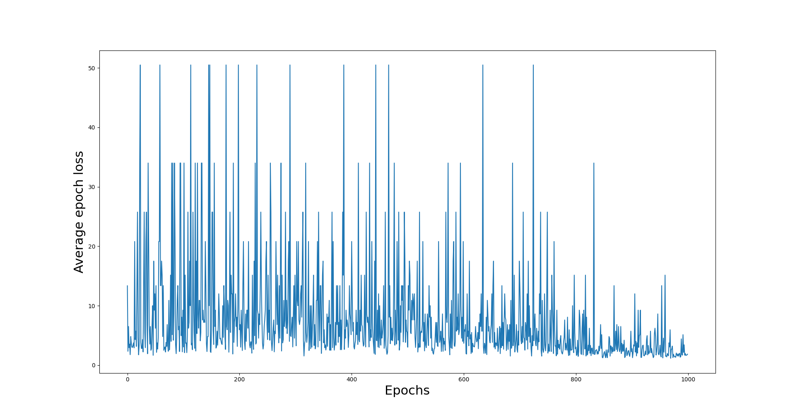
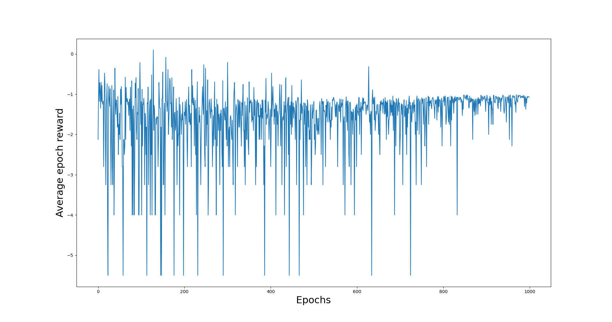

# Example 12: DQN algorithm on Gridworld

In this example, we will train an agent so that it learns to navigate itself in a grid.
Specifically, we will be using the ```Gridworld``` environment from the book <a href="https://www.manning.com/books/deep-reinforcement-learning-in-action">Deep Reinforcement Learning in Action</a>.
The environment is implemented in <a herf="https://github.com/pockerman/rlenvs_from_cpp">rlenvs_from_cpp</a>; 
check the class <a href="https://github.com/pockerman/rlenvs_from_cpp/blob/master/src/rlenvs/envs/grid_world/grid_world_env.h">Gridworld</a>. 

We will use the DQN algorithm, see <a href="https://www.manning.com/books/deep-reinforcement-learning-in-action">Deep Reinforcement Learning in Action</a> and references therein,
in order to train our agent. We will use a static environment configuration in this example something that makes this problem a lot easier to work on.
This example uses the same model as is done in the <a href="https://www.manning.com/books/deep-reinforcement-learning-in-action">Deep Reinforcement Learning in Action</a> 
book so you may also want to follow the code therein.

## Driver code

```
#include "cubeai/base/cubeai_config.h"

#ifdef USE_PYTORCH

#include "cubeai/base/cubeai_types.h"

#include "cubeai/rl/trainers/rl_serial_agent_trainer.h"
#include "cubeai/maths/optimization/optimizer_type.h"
#include "cubeai/maths/optimization/pytorch_optimizer_factory.h"
#include "cubeai/rl/policies/epsilon_greedy_policy.h"
#include "cubeai/utils/torch_adaptor.h"
#include "cubeai/maths/vector_math.h"

#include "rlenvs/utils/io/csv_file_writer.h"
#include "rlenvs/envs/grid_world/grid_world_env.h"

#include <boost/log/trivial.hpp>
#include <torch/torch.h>

#include <unordered_map>
#include <iostream>
#include <string>
#include <any>
#include <filesystem>
#include <map>
#include <vector>

namespace rl_example_12{

const std::string EXPERIMENT_ID = "3";

namespace F = torch::nn::functional;

using cuberl::real_t;
using cuberl::uint_t;
using cuberl::float_t;
using cuberl::torch_tensor_t;
using cuberl::rl::RLSerialAgentTrainer;
using cuberl::rl::RLSerialTrainerConfig;
using cuberl::rl::policies::EpsilonGreedyPolicy;
using rlenvscpp::envs::grid_world::Gridworld;
using rlenvscpp::utils::io::CSVWriter;

constexpr uint_t l1 = 64;
constexpr uint_t l2 = 150;
constexpr uint_t l3 = 100;
constexpr uint_t l4 = 4;
constexpr uint_t SEED = 42;
constexpr uint_t TOTAL_EPOCHS = 1000;
constexpr uint_t TOTAL_ITRS_PER_EPOCH = 50;
constexpr real_t GAMMA = 0.9;
constexpr real_t EPSILON = 1.0;
constexpr real_t LEARNING_RATE = 1.0e-3;


// The class that models the Policy network to train
class QNetImpl final : public torch::nn::Module
{
public:
    QNetImpl();
    torch_tensor_t forward(torch_tensor_t);
private:
   torch::nn::Linear fc1_;
   torch::nn::Linear fc2_;
   torch::nn::Linear fc3_;
};

QNetImpl::QNetImpl()
    :
      fc1_(torch::nn::Linear(l1, l2)),
      fc2_(torch::nn::Linear(l2, l3)),
      fc3_(torch::nn::Linear(l3, l4))
{
    register_module("fc1", fc1_);
    register_module("fc2", fc2_);
    register_module("fc3", fc3_);
}


torch_tensor_t
QNetImpl::forward(torch_tensor_t x){

    x = F::relu(fc1_->forward(x));
    x = fc2_->forward(x);
    x = F::relu(fc3_->forward(x));
    return x; 
}

// create the model
TORCH_MODULE(QNet);

// 4x4 grid
typedef Gridworld<4> env_type;
typedef env_type::state_type state_type;


std::vector<float_t>
flattened_observation(const state_type& state){
	
	std::vector<float_t> data;
	data.reserve(64);
	
	for(uint_t i=0; i<state.size(); ++i){
		for(uint_t j=0; j<state[i].size(); ++j){
			for(uint_t k=0; k<state[i][j].size(); ++k){
				data.push_back(state[i][j][k]);
			}
		}
	}
	
	return data;
}

}


int main(){

    using namespace rl_example_12;

    try{

        BOOST_LOG_TRIVIAL(info)<<"Starting agent training...";
        BOOST_LOG_TRIVIAL(info)<<"Number of episodes to train: "<<TOTAL_EPOCHS;

        // let's create a directory where we want to
        //store all the results from running a simulation
        std::filesystem::create_directories("experiments/" + EXPERIMENT_ID);

        // set the seed for PyTorch
        torch::manual_seed(SEED);

        BOOST_LOG_TRIVIAL(info)<<"Creating the environment...";

        // create a 4x4 grid
        auto env = env_type();

        std::unordered_map<std::string, std::any> options;
        env.make("v1", options);

        BOOST_LOG_TRIVIAL(info)<<"Done...";
        BOOST_LOG_TRIVIAL(info)<<"Environment name: "<<env.name;
        BOOST_LOG_TRIVIAL(info)<<"Number of actions available: "<<env.n_actions();
        BOOST_LOG_TRIVIAL(info)<<"Number of states available: "<<env.n_states();

        // the network to train for the q values
        QNet qnet;

        auto optimizer_ptr = std::make_unique<torch::optim::Adam>(qnet->parameters(),
                                                                  torch::optim::AdamOptions(LEARNING_RATE));

        // we will use an epsilon-greedy policy
        EpsilonGreedyPolicy policy(	EPSILON, 
									SEED, 
									cuberl::rl::policies::EpsilonDecayOption::NONE);

        // the loss function to use
        auto loss_fn = torch::nn::MSELoss();

        std::vector<real_t> losses;
		std::vector<real_t> rewards;
        losses.reserve(TOTAL_EPOCHS);
		rewards.reserve(TOTAL_EPOCHS);

        // loop over the epochs
        for(uint_t epoch=0; epoch < TOTAL_EPOCHS; ++epoch){

            BOOST_LOG_TRIVIAL(info)<<"Starting epoch: "<<epoch;

            // for every new epoch we reset the environment
            auto time_step = env.reset();
            auto done = false;
			uint_t step_counter = 0;
			std::vector<real_t> epoch_loss;
			std::vector<real_t> epoch_rewards;
			std::vector<float_t> rand_vec(64, 0.0);
			epoch_loss.reserve(TOTAL_ITRS_PER_EPOCH);

            while(!done){

				auto obs = flattened_observation(time_step.observation());
				
				float_t a = 0.0;
				float_t b = 1.0;
				rand_vec = cuberl::maths::randomize(rand_vec, a, b, 64);
				rand_vec = cuberl::maths::divide(rand_vec, 10.0);
				
				// randomize the flattened observation
				obs = cuberl::maths::add(obs, rand_vec);
				auto torch_state = cuberl::utils::pytorch::TorchAdaptor::to_torch(obs, 
				                                                                  cuberl::DeviceType::CPU);
                
                // get the qvals
                auto qvals = qnet(torch_state);
                auto action_idx = policy(qvals, cuberl::torch_tensor_value_type<float_t>());
				
				BOOST_LOG_TRIVIAL(info)<<"\tAction selected: "<<action_idx<<std::endl;

				// step in the environment
                time_step = env.step(action_idx);

				obs = flattened_observation(time_step.observation());
				// randomize the flattened observation
				obs = cuberl::maths::add(obs, rand_vec);
				
                torch_state = cuberl::utils::pytorch::TorchAdaptor::to_torch(obs, 
				                                                             cuberl::DeviceType::CPU);

                // tell the model that we don't use grad here
                qnet->eval();
                auto new_q_vals = qnet(torch_state);
				
				// we are training again
				qnet->train();

                // find the maximum
                auto max_q = torch::max(new_q_vals);
                auto reward = time_step.reward();
				
				BOOST_LOG_TRIVIAL(info)<<"\tReward: "<<reward;

                auto y = torch::tensor({reward});
                if(reward == -1.0){
                    y +=  max_q * GAMMA;
                }

            	// in the code below to break the computation graph
            	// and prevent gradients from flowing backward through
            	// parts of the model that shouldn't be updated during backpropagation.
            	y = y.detach();
            	auto X = qvals.squeeze()[action_idx].unsqueeze(0);
				
                // calculate the loss
                auto loss = loss_fn(X, y); 

            	optimizer_ptr -> zero_grad();
				loss.backward();
                optimizer_ptr -> step();

                epoch_loss.push_back(loss.item<real_t>());
            	epoch_rewards.push_back(reward);
				step_counter += 1;

            	BOOST_LOG_TRIVIAL(info)<<"\tLoss at epoch: "<<loss.item<real_t>();

            	// update done
            	done = time_step.done();
            	if(done){
            		BOOST_LOG_TRIVIAL(info)<<"\tFinishing epoch at step: "<<step_counter;
            	}
            }

            BOOST_LOG_TRIVIAL(info)<<"Epoch finished...";
			
			// get the epsilon
			auto eps = policy.eps_value();
			if(eps > 0.1){
				eps -= 1/static_cast<real_t>(TOTAL_EPOCHS);
				policy.set_eps_value(eps);
			}
			
			losses.push_back(cuberl::maths::mean(epoch_loss.begin(),
													epoch_loss.end()));
			rewards.push_back(cuberl::maths::mean(epoch_rewards.begin(),
                                                    epoch_rewards.end()));
        }

        // save the rewards per episode for visualization
        // purposes
        auto filename = std::string("experiments/") + EXPERIMENT_ID;
        filename += "/dqn_grid_world_policy_rewards.csv";

        CSVWriter rewards_csv_writer(filename, CSVWriter::default_delimiter());
        rewards_csv_writer.open();
		rewards_csv_writer.write_column_vector(rewards);
		rewards_csv_writer.close();

    	filename = std::string("experiments/") + EXPERIMENT_ID;
    	filename += "/dqn_grid_world_policy_losses.csv";

    	CSVWriter losses_csv_writer(filename, CSVWriter::default_delimiter());
    	losses_csv_writer.open();
    	losses_csv_writer.write_column_vector(losses);
    	losses_csv_writer.close();
    }
    catch(std::exception& e){
        std::cout<<e.what()<<std::endl;
    }
    catch(...){
        std::cout<<"Unknown exception occured"<<std::endl;
    }
    return 0;
}
#else
#include <iostream>
int main(){

	std::cout<<"This example requires PyTorch"<<std::endl;
	std::cout<<"Reconfigure cuberl with USE_PYTORCH flag turned ON."<<std::endl;
    return 0;
}
#endif


```

Running the code above produces the following output:

```
[2025-06-28 09:22:40.880018] [0x00007f2d122e96c0] [info]    Starting agent training...
[2025-06-28 09:22:40.880034] [0x00007f2d122e96c0] [info]    Number of episodes to train: 1000
[2025-06-28 09:22:40.880258] [0x00007f2d122e96c0] [info]    Creating the environment...
[2025-06-28 09:22:40.880571] [0x00007f2d122e96c0] [info]    Done...
[2025-06-28 09:22:40.880577] [0x00007f2d122e96c0] [info]    Environment name: Gridworld
[2025-06-28 09:22:40.880583] [0x00007f2d122e96c0] [info]    Number of actions available: 4
[2025-06-28 09:22:40.880589] [0x00007f2d122e96c0] [info]    Number of states available: 16
[2025-06-28 09:22:40.906067] [0x00007f2d122e96c0] [info]    Starting epoch: 0
[2025-06-28 09:22:40.935573] [0x00007f2d122e96c0] [info]    	Action selected: 1

[2025-06-28 09:22:40.938906] [0x00007f2d122e96c0] [info]    	Reward: -1
[2025-06-28 09:22:40.959139] [0x00007f2d122e96c0] [info]    	Loss at epoch: 0.916412
[2025-06-28 09:22:40.959847] [0x00007f2d122e96c0] [info]    	Action selected: 3

[2025-06-28 09:22:40.959968] [0x00007f2d122e96c0] [info]    	Reward: -1
[2025-06-28 09:22:40.960585] [0x00007f2d122e96c0] [info]    	Loss at epoch: 1.00951
[2025-06-28 09:22:40.960717] [0x00007f2d122e96c0] [info]    	Action selected: 3

[2025-06-28 09:22:40.960817] [0x00007f2d122e96c0] [info]    	Reward: -1
[2025-06-28 09:22:40.961204] [0x00007f2d122e96c0] [info]    	Loss at epoch: 0.909553
[2025-06-28 09:22:40.961301] [0x00007f2d122e96c0] [info]    	Action selected: 0

[2025-06-28 09:22:40.961388] [0x00007f2d122e96c0] [info]    	Reward: -1
[2025-06-28 09:22:40.961730] [0x00007f2d122e96c0] [info]    	Loss at epoch: 0.928638
[2025-06-28 09:22:40.961826] [0x00007f2d122e96c0] [info]    	Action selected: 2

[2025-06-28 09:22:40.961911] [0x00007f2d122e96c0] [info]    	Reward: -1
[2025-06-28 09:22:40.962236] [0x00007f2d122e96c0] [info]    	Loss at epoch: 1.04332
[2025-06-28 09:22:40.962330] [0x00007f2d122e96c0] [info]    	Action selected: 3

[2025-06-28 09:22:40.962415] [0x00007f2d122e96c0] [info]    	Reward: -1
[2025-06-28 09:22:40.962731] [0x00007f2d122e96c0] [info]    	Loss at epoch: 0.94848
[2025-06-28 09:22:40.962823] [0x00007f2d122e96c0] [info]    	Action selected: 2

[2025-06-28 09:22:40.962907] [0x00007f2d122e96c0] [info]    	Reward: -1
[2025-06-28 09:22:40.963226] [0x00007f2d122e96c0] [info]    	Loss at epoch: 1
[2025-06-28 09:22:40.963320] [0x00007f2d122e96c0] [info]    	Action selected: 2

[2025-06-28 09:22:40.963405] [0x00007f2d122e96c0] [info]    	Reward: -10
[2025-06-28 09:22:40.963723] [0x00007f2d122e96c0] [info]    	Loss at epoch: 100
[2025-06-28 09:22:40.963729] [0x00007f2d122e96c0] [info]    	Finishing epoch at step: 8
[2025-06-28 09:22:40.963746] [0x00007f2d122e96c0] [info]    Epoch finished...
[2025-06-28 09:22:40.964847] [0x00007f2d122e96c0] [info]    Starting epoch: 1
[2025-06-28 09:22:40.965032] [0x00007f2d122e96c0] [info]    	Action selected: 0

[2025-06-28 09:22:40.965122] [0x00007f2d122e96c0] [info]    	Reward: -1
[2025-06-28 09:22:40.965463] [0x00007f2d122e96c0] [info]    	Loss at epoch: 1
[2025-06-28 09:22:40.965562] [0x00007f2d122e96c0] [info]    	Action selected: 1

[2025-06-28 09:22:40.965646] [0x00007f2d122e96c0] [info]    	Reward: -1
[2025-06-28 09:22:40.965969] [0x00007f2d122e96c0] [info]    	Loss at epoch: 1
[2025-06-28 09:22:40.966065] [0x00007f2d122e96c0] [info]    	Action selected: 0

[2025-06-28 09:22:40.966149] [0x00007f2d122e96c0] [info]    	Reward: -1
[2025-06-28 09:22:40.966467] [0x00007f2d122e96c0] [info]    	Loss at epoch: 1
[2025-06-28 09:22:40.966560] [0x00007f2d122e96c0] [info]    	Action selected: 0

[2025-06-28 09:22:40.966643] [0x00007f2d122e96c0] [info]    	Reward: -1
[2025-06-28 09:22:40.966957] [0x00007f2d122e96c0] [info]    	Loss at epoch: 1
[2025-06-28 09:22:40.967051] [0x00007f2d122e96c0] [info]    	Action selected: 0

[2025-06-28 09:22:40.967134] [0x00007f2d122e96c0] [info]    	Reward: -1
[2025-06-28 09:22:40.967450] [0x00007f2d122e96c0] [info]    	Loss at epoch: 1
[2025-06-28 09:22:40.967544] [0x00007f2d122e96c0] [info]    	Action selected: 1

...
```

The average per epoch loss is shown in the figure below

|  |
|:---------------------------------------------------:|
|         **Figure: Average loss per epoch.**         |

|  |
|:-----------------------------------------------------:|
|         **Figure: Average reward per epoch.**         |

