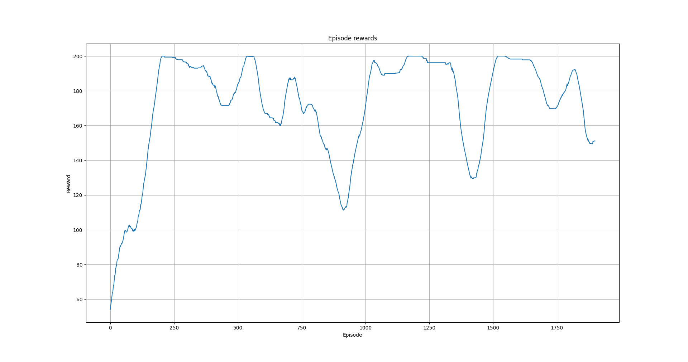
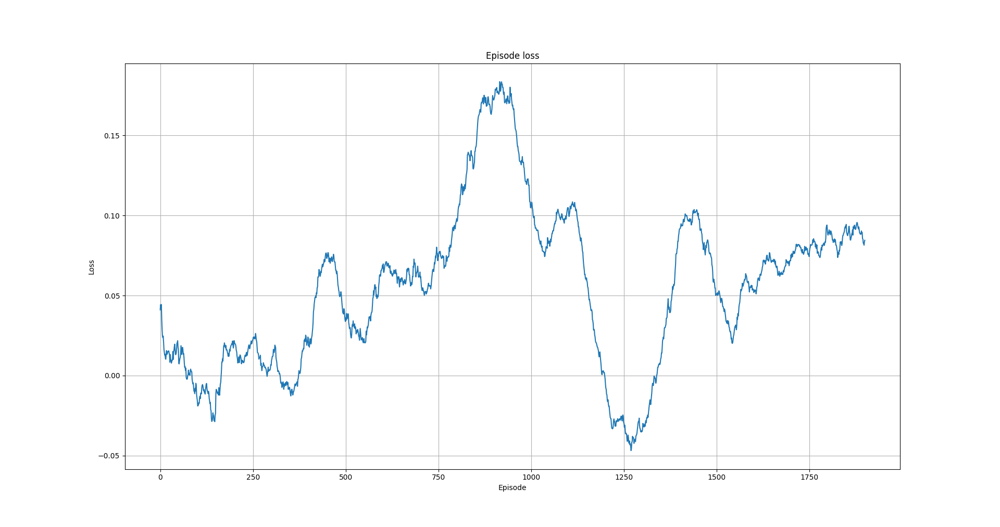
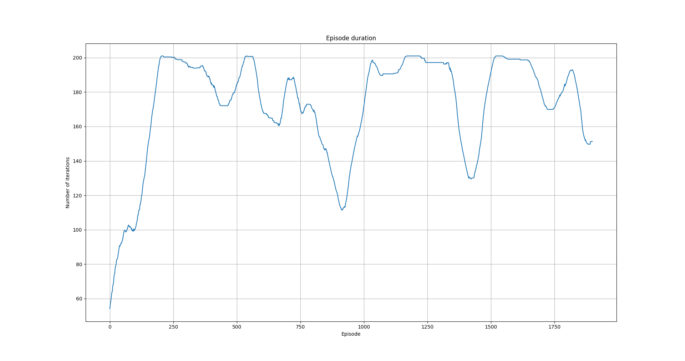

# Example 20: REINFORCE with baseline algorithm on CartPole

The example <a href="https://github.com/pockerman/cuberl/blob/master/examples/rl/rl_example_13/rl_example_13.md"> REINFORCE algorithm on CartPole</a>
used the REINFORCE algorithm to build an agent that can control the ```CratPole``` environment.
The REINFORCE algorithm is very sensitive to gradient variance which in turn can affect
training. 

In this example, we will extend the REINFORCE algorithm using a baseline.
This is a generalisation of the REINFORCE algorithm to include a comparison 
of the action value to an arbitrary baseline $b(s)$ [1]. 
Hence, the gradient of the cost function is now proportional to 

$$\nabla J(\boldsymbol{\theta}_{t}) \propto \sum_{s} \mu(s) \sum_{\alpha}\left(q_{\pi}(s,\alpha) - b(s)\right )\nabla \pi(\alpha | s,  \boldsymbol{\theta})  $$

Note that the baseline can be any function, even a random variable, as long as it does not vary with $\alpha$. 
The update rule in this version of REINFORCE is [1].

$$\boldsymbol{\theta}_{t+1} = \boldsymbol{\theta}_{t} + \alpha \left(G_t - b(S_t)\right )\frac{\nabla \pi(A_t | S_t, \boldsymbol{\theta}_t)}{\pi(A_t | S_t, \boldsymbol{\theta}_t)}$$

The baseline function, as mentioned above, can be any function even a unformly zero. 
Thus, the update rule above is a generalization of the REINFORCE algorithm [1]. Although the baseline does not affect the expected value of the update, it can have a, large, effect on its variance [1].
A choice for the baseline is an estimate of the state value i.e. $\hat{v}(S_t, \mathbf{w})$ where $\mathbf{w} \in \mathbb{R}^m$ is a weight vector.


We will again use the ```gymnasium.CartPole``` environment.
Specifically, we will use the class <a href="https://github.com/pockerman/rlenvs_from_cpp/blob/master/src/rlenvs/envs/gymnasium/classic_control/cart_pole_env.h">CartPole</a> class from
<a href="https://github.com/pockerman/rlenvs_from_cpp/tree/master">rlenvs_from_cpp</a> library. This is a simple class that allows us to
sent HTTP requests to a server that actually runs the environment. We need this as ```gymnasium.CartPole``` is written in Python and we 
want to avoid the complexity of directly executing Python code from the C++ driver.

We will use the policy network we used in <a href="https://github.com/pockerman/cuberl/blob/master/examples/rl/rl_example_13/rl_example_13.md">REINFORCE algorithm on CartPole</a>
The configuation of the REINFORCE solver supports three types of baseline values

- A user specified constant
- Mean value
- Standardization

In this example we will use standardization or whitening as a baseline. In this case the baseline term is given 
by


----
**Remark**

The Medium  article https://medium.com/@fork.tree.ai/understanding-baseline-techniques-for-reinforce-53a1e2279b57
provides a nice overview of baseline techniques.

----

$$b(S_t) = \frac{G_t - \bar{G}}{\sigma_{G}}$$

Recall that $G_t$ is the total, discounted, reward over the episode i.e.

$$G_t = \sum_{i} \gamma^ir_i$$

where $i$ denotes the iteration index within the episode.

Other than that this example is similar to the aforementioned example. Feel free to experiment
with the various baseline types. The dirver code is shown below.

## Driver code

```
#include "cubeai/base/cubeai_config.h"

#ifdef USE_PYTORCH

#include "cubeai/base/cubeai_types.h"
#include "cubeai/rl/algorithms/pg/reinforce.h"
#include "cubeai/rl/trainers/rl_serial_agent_trainer.h"
#include "cubeai/maths/optimization/optimizer_type.h"
#include "cubeai/maths/optimization/pytorch_optimizer_factory.h"
#include "cubeai/maths/statistics/distributions/torch_categorical.h"

#include "rlenvs/utils/io/csv_file_writer.h"
#include "rlenvs/envs/api_server/apiserver.h"
#include "rlenvs/envs/gymnasium/classic_control/cart_pole_env.h"

#include <boost/log/trivial.hpp>

#include <torch/torch.h>

#include <unordered_map>
#include <iostream>
#include <string>
#include <any>
#include <filesystem>
#include <map>

namespace rl_example_13{


const std::string SERVER_URL = "http://0.0.0.0:8001/api";
const std::string EXPERIMENT_ID = "2";
const std::string POLICY = "policy.csv";

namespace F = torch::nn::functional;

using cuberl::real_t;
using cuberl::uint_t;
using cuberl::float_t;
using cuberl::int_t;
using cuberl::torch_tensor_t;
using cuberl::DeviceType;
using cuberl::rl::algos::pg::ReinforceSolver;
using cuberl::rl::algos::pg::ReinforceConfig;
using cuberl::rl::algos::pg::BaselineEnumType;
using cuberl::rl::RLSerialAgentTrainer;
using cuberl::rl::RLSerialTrainerConfig;
using cuberl::maths::stats::TorchCategorical;
using rlenvscpp::envs::RESTApiServerWrapper;	
using rlenvscpp::envs::gymnasium::CartPole;


const uint_t L1 = 4;
const uint_t L2 = 128;
const uint_t L3 = 2;
const real_t LEARNING_RATE = 0.01;


// The class that models the Policy network to train
class PolicyNetImpl: public torch::nn::Module
{
public:

    PolicyNetImpl();
	
	// To execute the network in C++, 
	// we simply call the forward() method
    torch_tensor_t forward(torch_tensor_t state);

    template<typename StateTp>
    std::tuple<uint_t, torch_tensor_t> act(const StateTp& state);
	
	void make_play(){is_playing_ = true;}
private:

   torch::nn::Linear fc1_;
   torch::nn::Dropout dp_;
   torch::nn::Linear fc2_;
   bool is_playing_{false};
};


PolicyNetImpl::PolicyNetImpl()
    :
      fc1_(torch::nn::Linear(L1, L2)),
	  dp_(torch::nn::Dropout(0.6)),
      fc2_(torch::nn::Linear(L2, L3))
{
    register_module("fc1", fc1_);
	register_module("dp", dp_);
    register_module("fc2", fc2_);
}


torch_tensor_t
PolicyNetImpl::forward(torch_tensor_t x){

	x = fc1_->forward(x);
	if(!is_playing_){
		x = dp_ -> forward(x);
		
	}
    x = F::relu(x);
    x = fc2_->forward(x);
    return F::softmax(x,  F::SoftmaxFuncOptions(0));
}


template<typename StateTp>
std::tuple<uint_t, torch_tensor_t>
PolicyNetImpl::act(const StateTp& state){

    auto torch_state = torch::tensor(state);
    auto probs = forward(torch_state);
	
    auto m = TorchCategorical(probs, false);
	
    auto action = m.sample();
    return std::make_tuple(action.item().toLong(), 
	                       m.log_prob(action));

}

TORCH_MODULE(PolicyNet);

typedef CartPole env_type;
typedef PolicyNet policy_type;
typedef ReinforceSolver<env_type, PolicyNet> solver_type;
}


int main(){
	
	BOOST_LOG_TRIVIAL(info)<<"Starting agent training";
    using namespace rl_example_13;

    try{

        // let's create a directory where we want to
        //store all the results from running a simualtion
        std::filesystem::create_directories("experiments/" + EXPERIMENT_ID);
        torch::manual_seed(42);

		BOOST_LOG_TRIVIAL(info)<<"Creating environment...";
		
		RESTApiServerWrapper server(SERVER_URL, true);
        auto env = CartPole(server);
	
        std::unordered_map<std::string, std::any> options;

        // with Gymnasium v0 is not working
        env.make("v1", options);
        env.reset();

        BOOST_LOG_TRIVIAL(info)<<"Done...";
		BOOST_LOG_TRIVIAL(info)<<"Number of actions="<<env.n_actions();

        PolicyNet policy;

		// configuration for the REINFORCE solver
		ReinforceConfig opts;
		
		const auto N_EPISODES = 2000;
								
		opts.gamma = 0.999;
		opts.normalize_rewards = false;
		opts.max_itrs_per_episode = 200; // the max we can get according to docs
		opts.n_episodes = N_EPISODES;
		opts.device_type = DeviceType::CPU;
		opts.baseline_type = BaselineEnumType::STANDARDIZE;

        std::map<std::string, std::any> opt_options;
        opt_options.insert(std::make_pair("lr", LEARNING_RATE));

		using namespace cuberl::maths;
        auto pytorch_ops = optim::pytorch::build_pytorch_optimizer_options(optim::OptimzerType::ADAM,
																		   opt_options);

        auto policy_optimizer = optim::pytorch::build_pytorch_optimizer(optim::OptimzerType::ADAM,
																		*policy, pytorch_ops);

        solver_type solver(opts, policy, policy_optimizer);
		
        RLSerialTrainerConfig config;
        config.n_episodes = N_EPISODES;
        config.output_msg_frequency = 20;
        RLSerialAgentTrainer<env_type, solver_type> trainer(config, solver);
		
        trainer.train(env);

        auto info = trainer.train(env);
        BOOST_LOG_TRIVIAL(info)<<"Training info...";
		BOOST_LOG_TRIVIAL(info)<<info;

        // save the rewards per episode for visualization
        // purposes
		auto experiment_path = std::string("experiments/") + EXPERIMENT_ID;
        
        // save the policy also so that we can load it and check
        // use it
        auto policy_model_filename = experiment_path + std::string("/reinforce_cartpole_policy.pth");
        
		
		torch::save(policy, policy_model_filename + std::string("policy.pth"));
		
		// or we can use serialize
        torch::serialize::OutputArchive archive;
        policy->save(archive);
        archive.save_to(policy_model_filename);
		
		// write the loss values
		auto& loss_vals  = solver.get_monitor().policy_loss_values;
		
		
		BOOST_LOG_TRIVIAL(info)<<"Loss values size: "<<loss_vals.size();
		rlenvscpp::utils::io::CSVWriter loss_csv_writer(experiment_path + "/" + "loss.csv",
														  rlenvscpp::utils::io::CSVWriter::default_delimiter());
		loss_csv_writer.open();
		
		auto episode_counter = 0;
		for(uint_t i=0; i<loss_vals.size(); ++i){
			std::tuple<uint_t, real_t> row = {episode_counter++, loss_vals[i]};
			loss_csv_writer.write_row(row);
		}
		
		loss_csv_writer.close();
		
		
		auto& rewards  = solver.get_monitor().rewards;
		rlenvscpp::utils::io::CSVWriter rewards_csv_writer(experiment_path + "/" + "rewards.csv",
														  rlenvscpp::utils::io::CSVWriter::default_delimiter());
		rewards_csv_writer.open();
		
		episode_counter = 0;
		
		for(uint_t i=0; i<rewards.size(); ++i){
			std::tuple<uint_t, real_t> row = {episode_counter++, rewards[i]};
			rewards_csv_writer.write_row(row);
		}
		
		rewards_csv_writer.close();
		
		
		auto& episode_duration  = solver.get_monitor().episode_duration;
		rlenvscpp::utils::io::CSVWriter episode_duration_csv_writer(experiment_path + "/" + "episode_duration.csv",
														            rlenvscpp::utils::io::CSVWriter::default_delimiter());
		episode_duration_csv_writer.open();
		
		episode_counter = 0;
		for(uint_t i=0; i<episode_duration.size(); ++i){
			std::tuple<uint_t, real_t> row = {episode_counter++, episode_duration[i]};
			episode_duration_csv_writer.write_row(row);
		}
		
		episode_duration_csv_writer.close();
		
		BOOST_LOG_TRIVIAL(info)<<"Finished agent training";
    }
    catch(std::exception& e){
        std::cout<<e.what()<<std::endl;
    }
    catch(...){
        std::cout<<"Unknown exception occured"<<std::endl;
    }
    return 0;
}
#else
#include <iostream>
int main(){

    std::cout<<"This example requires PyTorch. Reconfigure cuberl with USE_PYTORCH fag turned ON."<<std::endl;
    return 0;
}
#endif


```

Running the driver above produces the following plots.


|  |
|:--:|
| **Figure 1: Undiscounted total reward for REINFORCE over training.**|

|  |
|:--:|
| **Figure 2: Loss for REINFORCE over training.**|

|  |
|:--:|
| **Figure 3: Episode duration for REINFORCE over training.**|

## Summary

This example extened example <a href="https://github.com/pockerman/cuberl/blob/master/examples/rl/rl_example_13/rl_example_13.md"> REINFORCE algorithm on CartPole</a>
by using a baseline term. Specifically, it used standarization or whitening as a baseline.
