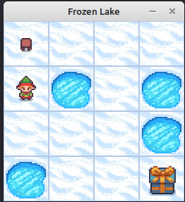
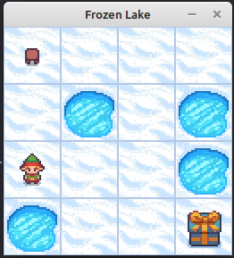
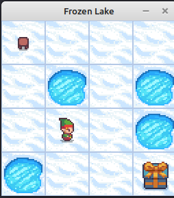
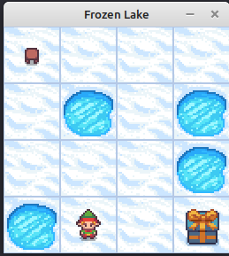
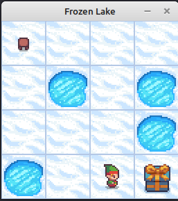
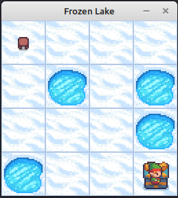

# Example 8: Value iteration on ```FrozenLake```


## The driver code

```
#include "cubeai/base/cubeai_types.h"
#include "cubeai/rl/algorithms/dp/value_iteration.h"
#include "cubeai/rl/trainers/rl_serial_agent_trainer.h"
#include "cubeai/rl/policies/uniform_discrete_policy.h"
#include "cubeai/rl/policies/stochastic_adaptor_policy.h"

#include "rlenvs/utils/io/csv_file_writer.h"
#include "rlenvs/envs/api_server/apiserver.h"
#include "rlenvs/envs/gymnasium/toy_text/frozen_lake_env.h"

#include <boost/log/trivial.hpp>
#include <tuple>

namespace rl_example_8{

const std::string SERVER_URL = "http://0.0.0.0:8001/api";
const std::string SOLUTION_FILE = "value_iteration_frozen_lake_v1.csv";
const std::string REWARD_PER_ITR = "reward_per_itr.csv";
const std::string POLICY = "policy.csv";

using cuberl::real_t;
using cuberl::uint_t;
using cuberl::rl::policies::UniformDiscretePolicy;
using cuberl::rl::policies::StochasticAdaptorPolicy;
using cuberl::rl::algos::dp::ValueIteration;
using cuberl::rl::algos::dp::ValueIterationConfig;
using cuberl::rl::RLSerialAgentTrainer;
using cuberl::rl::RLSerialTrainerConfig;

using rlenvscpp::envs::gymnasium::FrozenLake;
using rlenvscpp::envs::RESTApiServerWrapper;

// the environment to use
typedef FrozenLake<4> env_type;

// value iteration solver
typedef  ValueIteration<env_type,
                        UniformDiscretePolicy,
                        StochasticAdaptorPolicy<UniformDiscretePolicy>> solver_type;
						
}

int main() {

	BOOST_LOG_TRIVIAL(info)<<"Starting agent training";
	
    using namespace rl_example_8;
	
	RESTApiServerWrapper server(SERVER_URL, true);

    // create the environment
    env_type env(server);

    BOOST_LOG_TRIVIAL(info)<<"Creating environment...";
    std::unordered_map<std::string, std::any> options;

	options["is_slippery"] = std::any(false);
    env.make("v1", options);
    env.reset();
    BOOST_LOG_TRIVIAL(info)<<"Done...";

    // start with a uniform random policy i.e.
    // the agnet knows nothing about the environment
    UniformDiscretePolicy init_policy(env.n_states(), env.n_actions());

    StochasticAdaptorPolicy<UniformDiscretePolicy> policy_adaptor(env.n_states(), 
	                                                         env.n_actions(), 
							         init_policy);

    ValueIterationConfig config;
    config.gamma = 0.99;
    config.tolerance = 1.0e-8;

    solver_type algorithm(config, init_policy, policy_adaptor);

    RLSerialTrainerConfig trainer_config = {10, 10000, 1.0e-8};

    RLSerialAgentTrainer<env_type, solver_type> trainer(trainer_config, algorithm);

    auto info_ = trainer.train(env);
	BOOST_LOG_TRIVIAL(info)<<info_;
	BOOST_LOG_TRIVIAL(info)<<"Saving solution to "<<SOLUTION_FILE;

    // save the value function into a csv file
    algorithm.save(SOLUTION_FILE);
	
	
	// save the reward the agent achieved per training epoch
	auto reward = trainer.episodes_total_rewards();
	auto iterations = trainer.n_itrs_per_episode();
	
	rlenvscpp::utils::io::CSVWriter csv_writer(REWARD_PER_ITR);
	csv_writer.open();
	
	csv_writer.write_column_names({"epoch", "reward"});
	
	auto epoch = static_cast<uint_t>(0);
	for(auto val: reward){
		
		std::tuple<uint_t, real_t> row = {epoch++, val};
		csv_writer.write_row(row);
	}
	
	csv_writer.close();
	
	// build the policy
	algorithm.build_policy(env).save(POLICY);
	
	BOOST_LOG_TRIVIAL(info)<<"Finished agent training";
    return 0;
}

```


|  |
|:--:|
| **Figure 3:Playing FrozenLake step 1.**|

|  |
|:--:|
| **Figure 4:Playing FrozenLake step 2.**|

|  |
|:--:|
| **Figure 5:Playing FrozenLake step 3.**|

|  |
|:--:|
| **Figure 6:Playing FrozenLake step 3.**|

|  |
|:--:|
| **Figure 7:Playing FrozenLake step 5.**|

|  |
|:--:|
| **Figure 8:Playing FrozenLake step 6.**|

