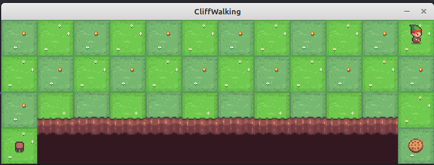

\page cuberl_example_13 CubeRL Example 13: SARSA on CliffWorld

In this example we will apply the SARSA algorithm on <a href="https://gymnasium.farama.org/environments/toy_text/cliff_walking/">CliffWorld</a>.
This is a Gymnasium-based environment implemented in \ref bitrl::envs::gymnasium::CliffWorld "bitrl::envs::gymnasium::CliffWorld" class.
All Gymnasium-based environments require an instance of the <a href="https://github.com/pockerman/bitrl-rest-api">bitrl-envs-api</a> server to run.

Temporal Difference Learning is a combination of dynamic programming and Monte Carlo. TDL does not use the environment transition probabilities and therefore is
a model-free algorithm. One problem with TDL is that we don't know which action to take; TDL approximate that state-value function $V(s)$
however, we cannot use the Bellman equations to establish the state-action value function $Q(s, \alpha)$ as we don't know the transition probabilities.
The solution thus is to approximate $Q(s, \alpha)$ directly. In this note we will discuss one such approach i.e. SARSA or State-Action-Reward-State-Action.

SARSA is  an on-policy method i.e. the agent takes actions and learns, that is it chooses the next $Q(s,\alpha)$,  under the policy $\pi$ it currently follows. 
When we update the value of $Q(s,\alpha)$ we take into account the value $Q(s_{t+1},\alpha_{t+1})$. 
Hence, with the SARSA algorithm we work with the following tuple $(s_t, \alpha_t, s_{t+1}, \alpha_{t+1})$.

----
**Remark**

Typically, the policy $\pi$ will an $\epsilon$-greedy policy but this need not be the case.

----

The following is the update formula that SARSA is using:

$$
Q(s_t, \alpha_t) = Q(s_t, \alpha_t) + \eta \left[r_{t+1} + \gamma Q(s_{t+1}, \alpha_{t+1}) - Q(s_t, \alpha_t)\right]
$$

The state-action value function that is learnt by SARSA reflect a real policy that includes both exploration noise and operational constraints.
The algorithm, compared to Q-learning, is more conservative and therefore convergence is slower. 

Let's have a closer look into the algorithm.

#### Step 1

Reinforcement learning algorithms will usually start by knowing nothing about the environment. So the first step is
to initialize the table that represents $Q(s,\alpha)$ to arbitrary values; often this is just zero. This however, can also
be values that encourage exploration.

#### Step 2

The algorithm begins by some be presented with a state. SARSA needs to decide what to do whilst at this state. This is done using a policy
$\pi$ which most often will be an $\epsilon-$greedy policy.

#### Step 3

The algorithm will execute the action that was selected from step 2. The environment will respond with a reward $r_t$ and the new state $s_{t+1}$.
However, we cannot update yet the table $Q(s,\alpha)$; we need to determine what we will do next. It uses the policy $\pi$ at the new state $s_{t+1}$
in order to select the new action $\alpha_{t+1}$. $\alpha_{t+1}$ is the action that the agent will take next. 
**This is the key SARSA step that distinguishes it from Q-learning.** [1]. We can now update the state-action value function.
The update rule, see above, is using the future $Q(s_{t+1}, \alpha_{t+1})$ in order to update the current $Q(s_{t}, \alpha_{t})$

#### Step 4

After updating, we move to $s_{t+1}$ and take action $\alpha_{t+1}$ and repeat step 3. 
If we've reached a terminal state (like the end of a game or a completed transaction), the episode ends and we start fresh.
The environment has to inform the agent about whether it reached the end of the game or not. So when we take an action in the environment,
we will usually receive not just a reward signal and the next state but also a flag indicating if the end of the game or simulation has been reached. 

The SARSA algorithm is implemented in the \ref cuberl::rl::algos::td::SarsaSolver "cuberl::rl::algos::td::SarsaSolver"  class

Below is the driver code for this example. 

@code{.cpp}
#include "cuberl/base/cubeai_types.h"
#include "cuberl/rl/algorithms/td/sarsa.h"
#include "cuberl/rl/policies/epsilon_greedy_policy.h"
#include "cuberl/rl/trainers/rl_serial_agent_trainer.h"
#include "bitrl/network/rest_rl_env_client.h"
#include "bitrl/envs/gymnasium/toy_text/cliff_world_env.h"

#include <boost/log/trivial.hpp>
#include <iostream>

@endcode

@code{.cpp}

namespace rl_example_9{

const std::string SERVER_URL = "http://0.0.0.0:8001/api";
const std::string SOLUTION_FILE = "sarsa_cliff_walking_v0.csv";
const std::string REWARD_PER_ITR = "reward_per_itr.csv";
const std::string POLICY = "policy.csv";

using cuberl::real_t;
using cuberl::uint_t;
using cuberl::rl::policies::EpsilonGreedyPolicy;
using cuberl::rl::algos::td::SarsaSolver;
using cuberl::rl::algos::td::SarsaConfig;
using cuberl::rl::policies::EpsilonDecayOption;
using cuberl::rl::RLSerialAgentTrainer;
using cuberl::rl::RLSerialTrainerConfig;
using rlenvscpp::envs::RESTApiServerWrapper;
typedef  rlenvscpp::envs::gymnasium::CliffWorld env_type;
}

int main(){

	BOOST_LOG_TRIVIAL(info)<<"Starting agent training";
    using namespace rl_example_9;

    try{

		RESTApiServerWrapper server(SERVER_URL, true);
		
        // create the environment
        env_type env(server);

        BOOST_LOG_TRIVIAL(info)<<"Creating environment...";
        std::unordered_map<std::string, std::any> options;
        env.make("v0", options);
        env.reset();
        BOOST_LOG_TRIVIAL(info)<<"Done...";

        BOOST_LOG_TRIVIAL(info)<<"Number of states="<<env.n_states();
        BOOST_LOG_TRIVIAL(info)<<"Number of actions="<<env.n_actions();

        // create an e-greedy policy. Use the number 
		// of actions as a seed. Use a constant epsilon
        EpsilonGreedyPolicy policy(0.1, env.n_actions(), 
		                           EpsilonDecayOption::NONE);

        SarsaConfig sarsa_config;
        sarsa_config.gamma = 1.0;
        sarsa_config.eta = 0.5;
        sarsa_config.tolerance = 1.0e-8;
        sarsa_config.max_num_iterations_per_episode = 100;
        sarsa_config.path = SOLUTION_FILE;

        SarsaSolver<env_type, EpsilonGreedyPolicy> algorithm(sarsa_config, policy);

        RLSerialTrainerConfig trainer_config = {10, 2000, 1.0e-8};

        RLSerialAgentTrainer<env_type,
                             SarsaSolver<env_type,
                             EpsilonGreedyPolicy>> trainer(trainer_config, algorithm);

        auto info = trainer.train(env);
        BOOST_LOG_TRIVIAL(info)<<"Training info..."<<info;
		BOOST_LOG_TRIVIAL(info)<<"Finished agent training";
		
		// save the reward the agent achieved per training epoch
		auto reward = trainer.episodes_total_rewards();
		auto iterations = trainer.n_itrs_per_episode();
	
		bitrl::utils::io::CSVWriter csv_writer(REWARD_PER_ITR);
		csv_writer.open();
		
		csv_writer.write_column_names({"epoch", "reward"});
		
		auto epoch = static_cast<uint_t>(0);
		for(auto val: reward){
			
			std::tuple<uint_t, real_t> row = {epoch++, val};
			csv_writer.write_row(row);
		}
		
		csv_writer.close();
		
		// build the policy
		algorithm.build_policy().save(POLICY);

    }
    catch(std::exception& e){
        std::cout<<e.what()<<std::endl;
    }
    catch(...){

        std::cout<<"Unknown exception occured"<<std::endl;
    }

    return 0;
}
@endcode

|  |
|:--:|
| **Figure 1:Playing CliffWorld step 1.**|

|  |
|:--:|
| **Figure 2:Playing CliffWorld step 3.**|

|  |
|:--:|
| **Figure 3:Playing CliffWorld step 5.**|

|  |
|:--:|
| **Figure 4:Playing CliffWorld step 11.**|

|  |
|:--:|
| **Figure 5:Playing CliffWorld step 14.**|

|  |
|:--:|
| **Figure 6:Playing CliffWorld step 17.**|

